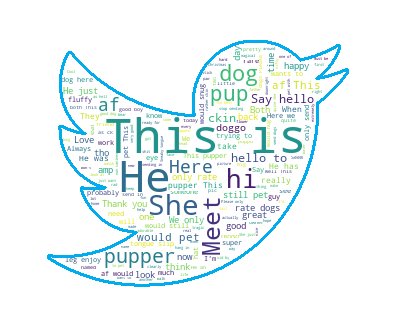

## Dog Rating Project

[#WeRateDogs](https://twitter.com/dog_rates) became an Internet sensation since the inception of the account in November 2015. It is a Twitter account that rates people's dogs on an unconventional scale and with a lot of humor. It's known for its unique dog rating system and the creative dog "stages" (floofer, doggo, pupper, puppo, blep, and snoot).

This project is divided into two parts. First, I wrangled the data from the @dog_rates account to prepare it for analysis. Then, I analyzed the cleaned dataset to understand the tweets popularity (popularity representing the number of 'likes' and retweets). I used linear regression techniques and performed sentiment analysis to answer the following question: 

**what type of tweets are more likely to be popular among the followers of the Twitter account `@dog_rates`?**

I came to the conclusion that: 

1. There's a strong positive correlation between "likes" and retweets (correlation coefficient: 0.93). The more "likes" a photo or a video receives, the more retweets the photo or video will get.
2. Videos are more popular than photos: they get 2.64 more likes than photos and 3.86 more retweets.
3. The more positive a tweet language is, the more popular it is.

 

